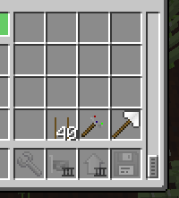
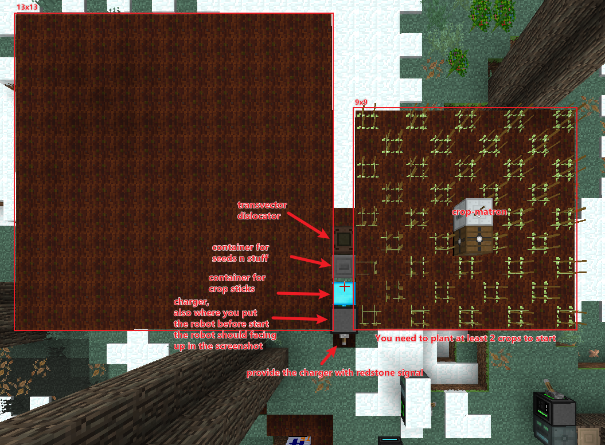
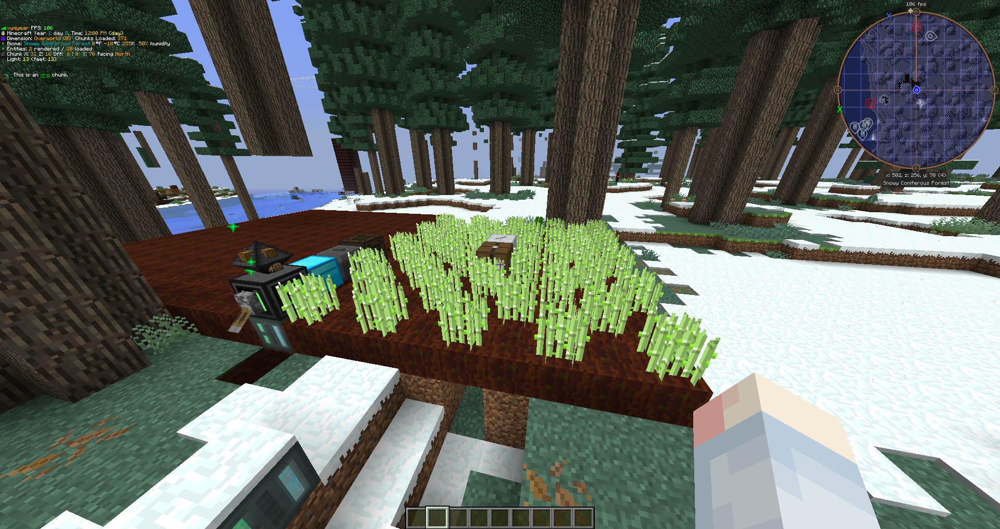

# auto-crossbreeding

## Setup

**Robot upgrades:**

- Inventory Upgrade
- Inventory Controller Upgrade
- Redstone Card
- Geolyzer (block)
- Internet Card (if you want to install over internet, not necessary.)

**Robot inventory:**

You need to put a spade in the last slot of the robot (if you have multiple inventory upgrades, you may scroll down to reach the last slot.)

You need to put a transvector binder in the second last slot.

The crop sticks will end up in the third last slot. You don't need to put them manually. The robot will automatically retrieve them from crop stick container automatically if needed.

**Farm setup:**

Setup for crossbreeding:

Setup for min-maxing:

The setup is pretty much the same except you don't need the 13*13 farmland on the left

Setup for spreading:

\[WIP\]

## Config

Explanation in config.lua

## To Install

    wget https://raw.githubusercontent.com/xyqyear/auto-crossbreeding/main/install.lua
    ./install

## To Run

For crossbreeding automatically:

    autoCrossbreed

For getting more crop from single crop (WIP):

    autoSpread

For min-maxing automatically:

    autoStat
